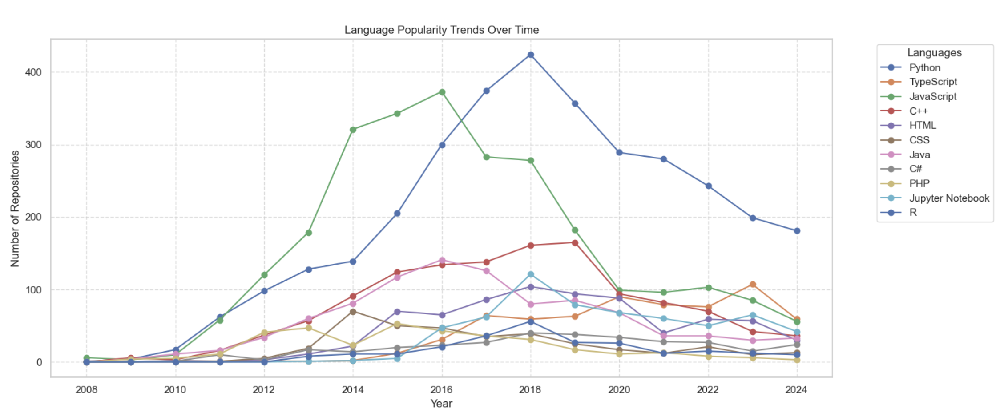

## Data Collection Overview

- <u>Data collection:</u> To grab the data, I checked out the GitHub API docs to get the lowdown on the endpoints and parameters I needed for my queries. I used the `requests` library to shoot out GET requests and pull in repository and user data. Then, I parsed the JSON responses into Pandas DataFrames for some deeper analysis.

- <u>Interesting facts</u> : <b>`TypeScript`</b> is emerging as a major growth opportunity in Zurich’s market, boasting a <b>20%</b> increase in demand compared to JavaScript. With just </b>15%</b> of developers currently using it (<i>low competition</i>), there’s a unique gap for developers to enhance their skills and marketability, positioning themselves ahead of the competition in this evolving landscape.

- <u>Actionable recommendations</u>:Developers should strategically combine `Python` and `TypeScript` skills to enhance their job market appeal. Python offers <b>3,301 </b>repositories and <b>86</b> hireable developers, while TypeScript is gaining traction in frontend development. By focusing on data-driven projects, developers can leverage Python’s versatility alongside TypeScript’s growth potential, creating a competitive edge in a rapidly evolving tech landscape.

**Note:** The dataset does not contain the entirety of 2024's days, as the year 2024 is not yet complete.
## Charts for the insights
### Language popularity over time 

### Typescript trend 

## Files

- **users.csv**: Contains information about 475 GitHub users in Delhi with over 100 followers.
- **repositories.csv**: Contains information about 22,697 public repositories from these users.

## Data Collection

- Data collected using GitHub API.
- Date of collection: 2024-10-29.
- Only included users with 100+ followers.
- Up to 500 most recently pushed repositories per user.